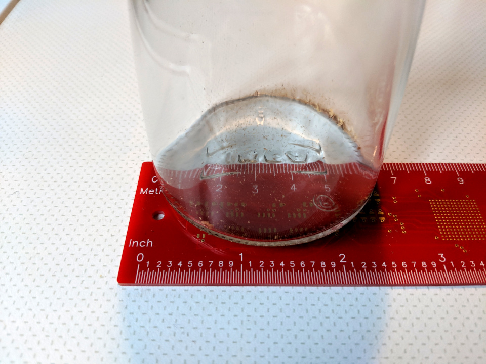
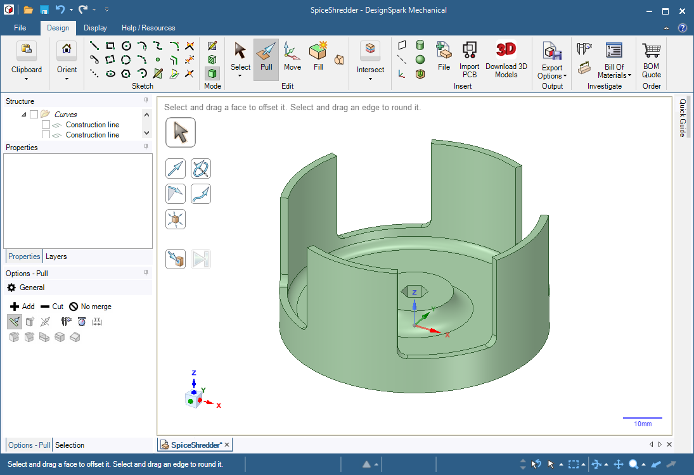
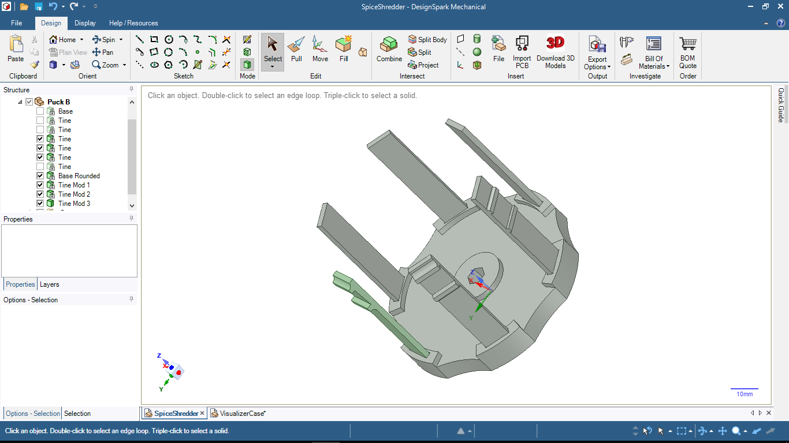
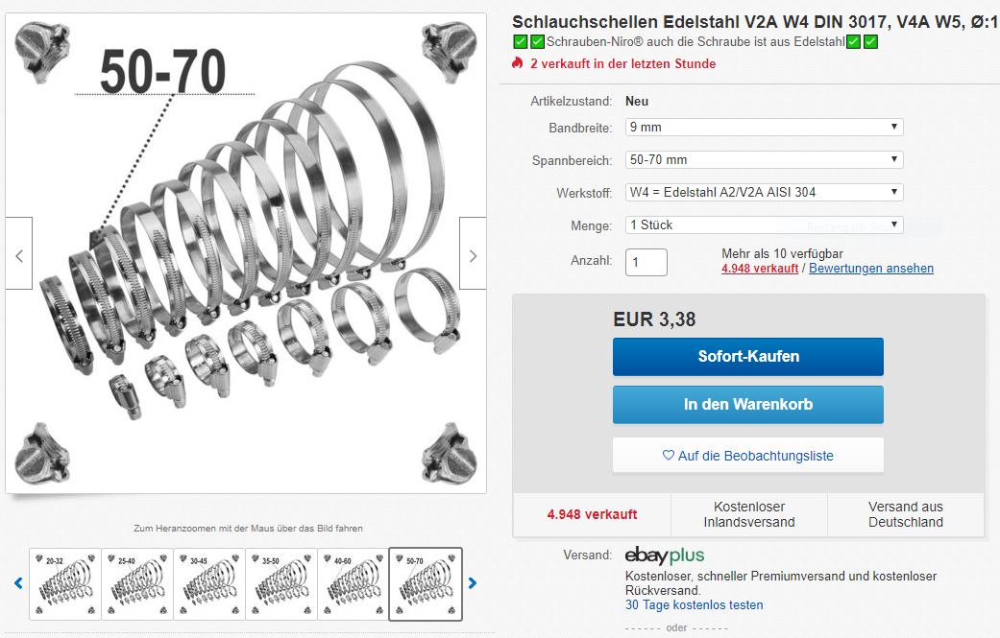

# IKEA Spice Shredder

This is a project to motorize an [IKEA 365+ IHÄRDIG](https://www.ikea.com/ms/en_US/usearch/?query=IH%C3%84RDIG) spice grinder using a 3D-printed drill adapter.

## Rationale

After spending 15 minutes using the IKEA 365+ IHÄRDIG spice grinder to make curry powder from whole spices by hand (and damn near giving myself a repetitive stress injury with a clockwise twisting motion), I decided that the best solution would be to hook up a drill, and use electricity to do the work instead.

Coffee and spice grinders are expensive. IKEA is affordable. And 3D printing is pretty cheap too, once you have a printer.

So the idea is to create a plastic piece that can grip the spice grinder, and then rotate the entire glass container rapidly.

## Measurements

The IHÄRDIG spice grinder has a 6.5cm diameter at the base, and tapers slightly inwards about 1mm per 2 centimeters of cylinder height.

The business end of the largest hex-head-driver in a standard IKEA [FIXA](https://www.ikea.com/ms/en_US/usearch/?query=fixa) toolkit is around 3 - 3.5mm per edge and 1cm long.

## Model 1

This does not work because the way the 2mm-thick walls are printed up, they are both brittle and very inflexible. They do not grip the glass walls of the spice grinder.

// Add picture of broken sections and highlight 2mm-only connection between base and tines here.

## Model 2

This model splits the plastic adapter into two pieces: the base and the tines.

The reason this is necessary, is because there is no way to mix the direction of printing within a single model and the base and tines need fibers perpendicular to one another.

The base can be printed cleanly from bottom to top with concentric circles and infill, and it can be completely rigid.

The tines must be printed lengthwise, because we need long polymer fibers that are flexible, unlike the stacked short fibers in Model 1.

Then, we tighten an adjustable hose clamp around the tines, pressing them against the glass body.

The picture above shows three slightly different designs for the tines, to be tested out.

The hose clamp is standard stainless 9mm width x 50 - 70mm diameter.

