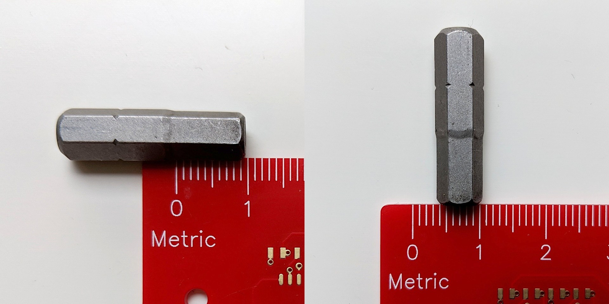
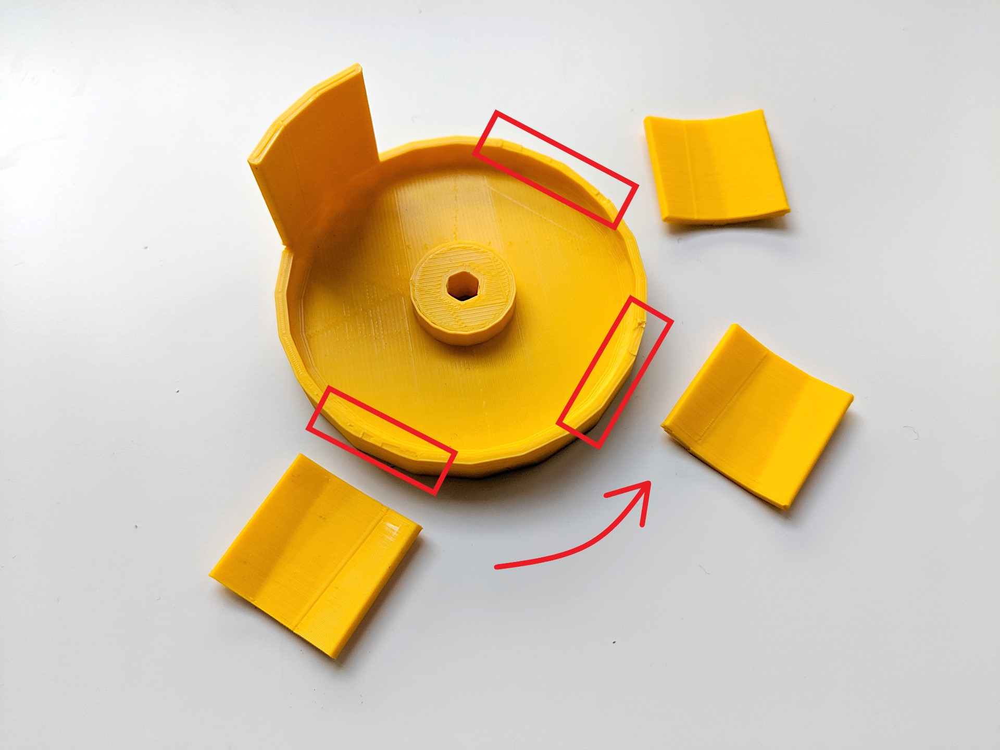
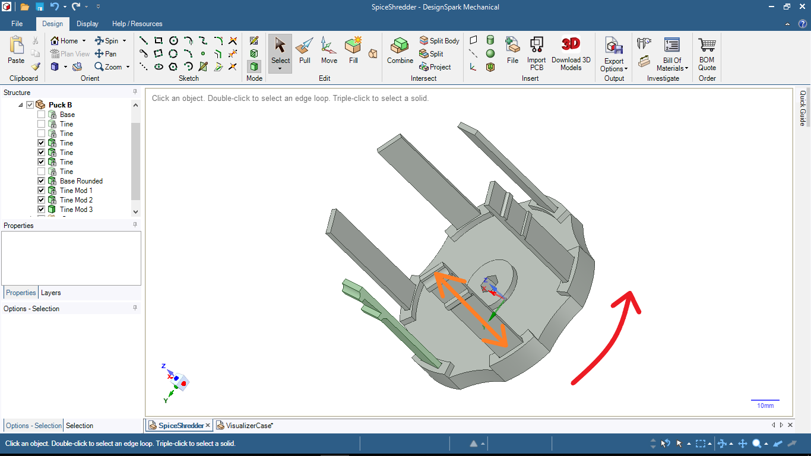
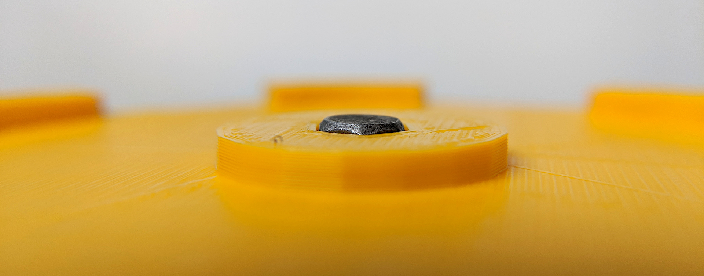
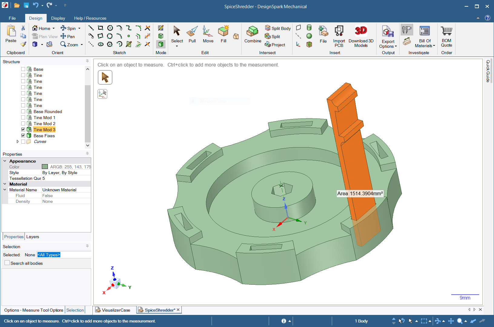
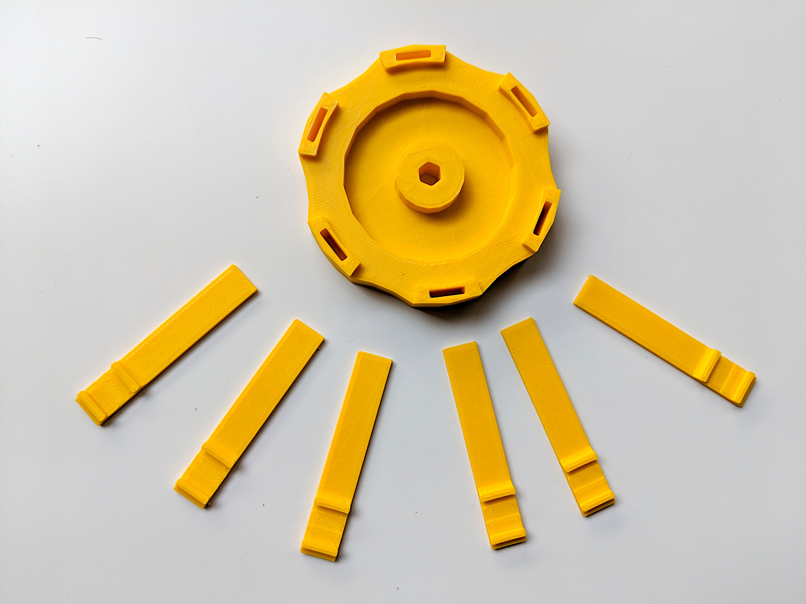
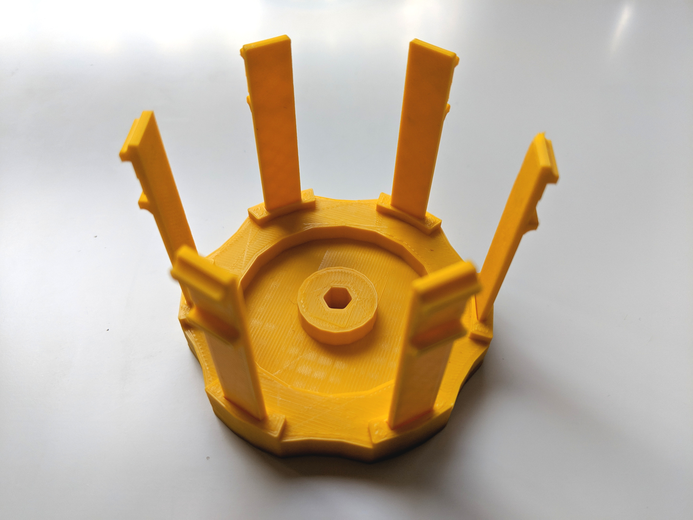
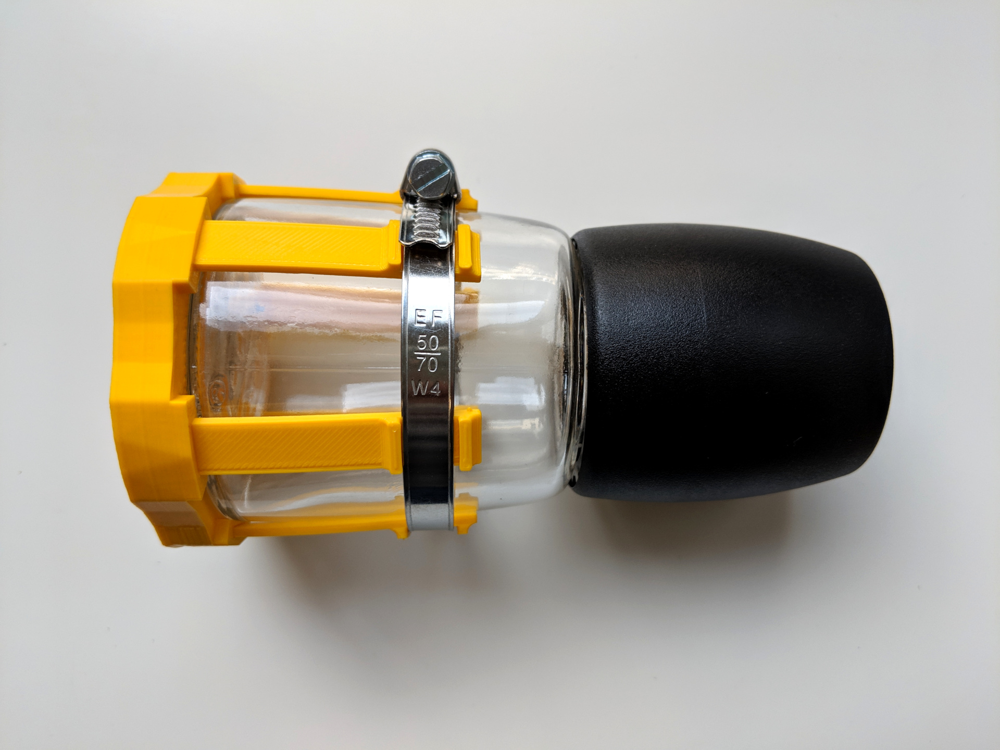
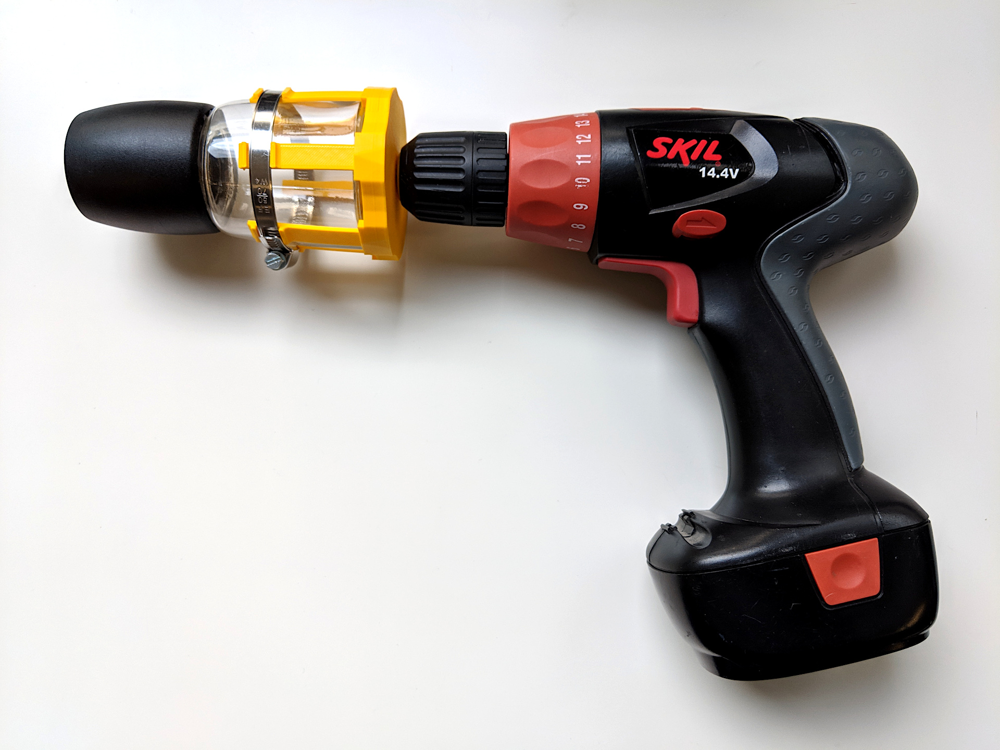
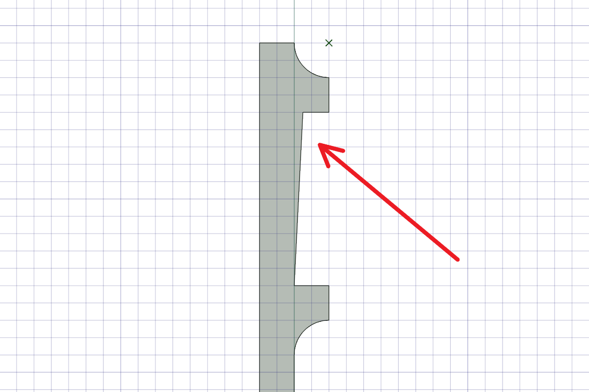

# IKEA Spice Shredder

This is a project to motorize an [IKEA 365+ IHÄRDIG](https://www.ikea.com/ms/en_US/usearch/?query=IH%C3%84RDIG) spice grinder using a 3D-printed drill adapter.

Anytime you motorize a grinder, it should be called a shredder.

## Rationale

After spending 15 minutes using this spice grinder to make curry powder from whole spices by hand (and nearly getting a repetitive stress injury with the clockwise twisting), I decided that the best solution would be to hook up a drill, and use electricity to do the work instead.

Electric coffee and spice grinders are expensive. IKEA is affordable. And 3D printing is pretty cheap too, once you have a printer.

So the idea is to create an adapter that can grip the spice grinder and rotate it rapidly.

It took three modeling attempts to do so, and since you learn a lot from failure, the whole process is captured here.

## Measurements

The IHÄRDIG spice grinder has a 6.5cm diameter base, and tapers slightly inwards about 1 - 1.5mm at  5 centimeters up the cylinder. I don't have a measurement [caliper](https://en.wikipedia.org/wiki/Calipers), so I had to eyeball these dimensions.

The business end of the largest hex-head driver in a standard IKEA [FIXA](https://www.ikea.com/ms/en_US/usearch/?query=fixa) toolkit is around 3 - 3.5mm per edge and 1cm long.

## Model 1 (Fail)

This does not work because the way the walls are printed up, they are brittle and inflexible.

The base is printed in concentric circles in the direction of the arrow. The 2mm-thick tines are attached in the same way. They simply _cannot_ flex, so at every connection point to the base, these parts break off instantly.

Also, the hole for the hex-head driver is too small.

## Model 2 (Fail)

This model splits the adapter into two pieces that are assembled: the base and the tines.

This is necessary, because there is no way to mix the direction of printing within a single model — the base and tines use fibers perpendicular to one another.

The base can be printed cleanly from bottom to top with concentric circles and infill, and it can be completely rigid.

The [tines](https://www.dictionary.com/browse/tines) must be printed lengthwise, because we need long polymer fibers that are flexible, unlike the densely-stacked short fibers in Model 1.

The picture above shows three slightly different designs for the tines, to be tested out.

This model almost works, the hole for the hex-head driver is perfectly sized. The problem is that the cylinder which grips the hex-head driver is slightly too short. So the driver sticks out by about 0.5mm, and it runs into the bottom of the spice grinder.

Also, there's some wasted plastic here.

## Model 3 (Win!)

This model corrects all of the issues in the other designs, and removes some unused plastic.

After printing a single test copy of the most-likely best tine model, I went ahead and printed five more like it. Then, I assembled these items together.

To make the adapter grip the glass, we tighten an adjustable hose clamp around the tines, pressing them against the glass jar.

There's one other feature to this tine as well. Because the top of the glass jar is narrower than the base, we have to add a small inclined plane, to account for when the hose clamp grips all 6 tines and they all flex inward to grip the glass.

The hose clamp is standard stainless 9mm width x 50 - 70mm diameter. In Germany, these are easy to source online; in the US, I'm pretty sure any Home Depot would have them.

Happy grinding, people! 😉
